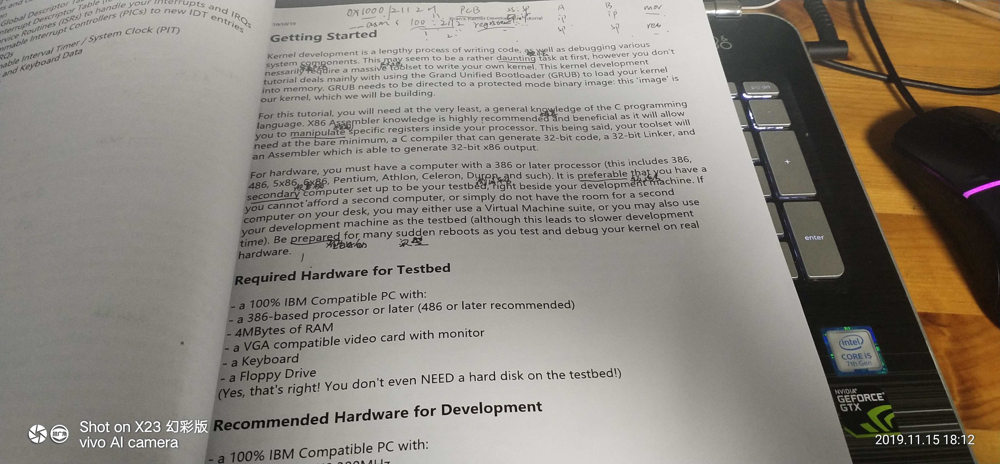

# YaOS
## 2019/11/15

​	从今天开始就要开始自己写操作系统了，想想还有点开心，本来自己存在了很多问题，在看完操作系统这门课时迫不及待的想尝试一下了，今天算是正式开始了，我会尽量每天花一定的时间来完善代码（抄代码）。今天其实算是入了一下门吧，其实，我已经根据这个[教程]( http://www.osdever.net/bkerndev/index.php )完成了一个bootloader,书上由于英语差，遗留了很多笔记，也算是翻透了它吧，总算对底层有了一个大概的映像。还有就是自己是在vscode上开发，在ubuntu中编译的，不过还是遇见了一些问题，我现在没办法把编译出来的kernel文件转化为img文件，算是一个坑吧，还是明天解决吧。

找个时间得把我在这个教程中遇见得问题给写出来。

## 2019/11/19

​	其实16号已经排除了所有错误了，但是最近在考试和复习，使我不能全身心投入到这个开发之中，后面还要考数据库，于是决定今晚将我自己在实施这个项目过程中遇见的错误写出来，避免遗忘。首先，我自己去教程网站下载了一个关于OS镜像文件【技术太差，始终无法构建grub的引导镜像】，并将其挂载上文件夹，将自己生成的bin文件把里面原来存在的文件替代了，在这个过程中，我遇见了很多问题，接下来就写遇见的问题吧

- 错误1

  

> 解决办法 加上 -fno-pic

- 错误2

> 解决办法 加上 -m32

- 错误3

  

> 解决办法 更改输出

- 错误4

  

> 解决办法 

- 错误5

  >  start.o: In function `stublet':
  > start.asm:(.text+0x29): undefined reference to `_main' 

> 解决办法

删除汇编源文件的下滑线即可

- 总结

>  到这里，这个教程的基本错误我已经都写出来了，不过在这个教程的学习中，我依然没有发现如何自己写交互，我决定自己在看几个教程试试，网上的资料繁多，我想自己找到一个路径去学习如何写操作系统，去真正的接触底层美学。

## 参考目录

 [ Bran's Kernel Development A tutorial on writing kernels ](http://www.osdever.net/bkerndev/Docs/title.htm )

[Xv6, a simple Unix-like teaching operating system]( https://pdos.csail.mit.edu/6.828/2011/xv6.html#v6 )

 [Xv6 中文](https://github.com/ranxian/xv6-chinese )

[ JamesM's kernel development tutorials ]( http://www.jamesmolloy.co.uk/tutorial_html/  )

[ hurlex 小内核分章节代码和文档 ]( https://github.com/hurley25/hurlex-doc/pulls )

[x86架构操作系统内核的实现](http://wiki.0xffffff.org/)